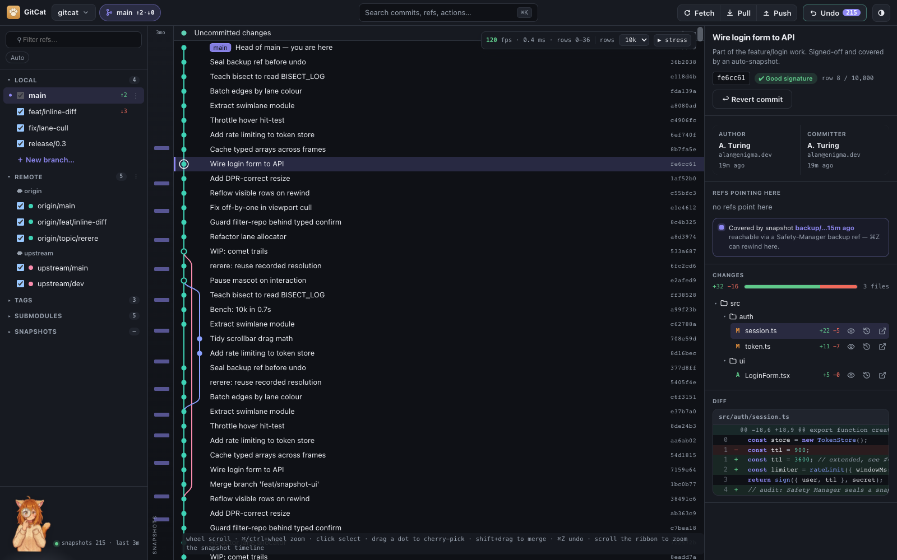

<div align="center">

# 🐱 GitCat

**A cozy, safety-first desktop Git client.**

Tauri 2 + Rust + Svelte 5, with a warm "Lamplight / Cozy Terminal" identity — and Tama, a cat mascot who reacts to what's actually happening and keeps a snapshot under you before every mutation.

[](https://github.com/zangjiucheng/GitCat/actions/workflows/ci.yml)
[](https://github.com/zangjiucheng/GitCat/actions/workflows/release.yml)
[](LICENSE)



</div>

## What is this?

GitCat is a desktop Git GUI built around one idea: every operation that touches your history should be reversible. A **Safety Manager** snapshots your repo before every mutation, so a global Undo (⌘Z) is always one keystroke away — and Undo is itself undoable.

## Features

**Core graph + history**

- Fast commit graph (git2 read + a hand-tuned Rust swimlane layout) on a virtualized canvas — smooth even on large repos
- Full commit detail panel: author/committer split, GPG status, diffstat, file tree, syntax-highlighted diff
- ⌘K command palette — fuzzy search across commits and refs

**Everyday git, made safe**

- Sidebar: branches / remotes / tags / snapshots, resizable, with a branch context menu
- Checkout a local branch, or a remote one — checking out `origin/feature-x` creates and switches to a local tracking branch automatically
- New Branch lets you pick the start point (any local/remote ref), not just HEAD
- Fetch / Pull (fast-forward only) / Push, from the top bar or the native Repository menu
- Drag-and-drop cherry-pick and merge (shift-drag) onto HEAD, with a real 3-way conflict resolver
- Linear rebase onto any branch — including multi-commit conflict sequences and mid-sequence skip
- `git bisect` — mark good/bad/skip, live canvas cues for the narrowing range, automatic first-bad detection
- `git-filter-repo` wizard — scope, preview, typed-confirm, and a full backup/restore safety net for the one genuinely irreversible operation in the app

**Safety Manager**

- Every mutation snapshots first; global Undo (⌘Z) is itself undoable
- Reflog rescue — browse and restore to any historical HEAD position
- rerere status/toggle panel

**Setup + polish**

- First-run setup wizard: pick a repo (click, or drag a folder in), check/fix its git identity, jump into the graph — shown once, not on every launch
- A real native app menu (File / Repository / Edit / View / Window / Help) and About panel, not just a default OS stub
- Dark theme by default (light available via the toggle)
- Eight Tama expressions reacting to what's actually happening — searching, thinking, celebrating, or genuinely alarmed

## Install

Download the installer for your platform from the [Releases page](https://github.com/zangjiucheng/GitCat/releases) — macOS (Apple Silicon + Intel), Windows (x86_64 + arm64), and Linux (x86_64 + arm64, `.deb`/`.rpm`/`.AppImage`) are all built from the same tag via a 6-platform release matrix.

> Builds are currently **unsigned** (no code-signing certificate configured yet):
>
> - **macOS**: right-click the app → **Open** the first time to get past Gatekeeper.
> - **Windows**: click **More info** → **Run anyway** on the SmartScreen prompt.

## Development

Requires [Rust](https://www.rust-lang.org/tools/install), [Node](https://nodejs.org) 22+, and [pnpm](https://pnpm.io).

```bash
pnpm install
pnpm tauri dev      # launch the app in dev mode
```

Other useful commands:

```bash
pnpm check          # svelte-check (type-check the frontend)
pnpm build          # build the frontend
pnpm test           # vitest (frontend unit tests)

cd src-tauri
cargo build         # build the Rust core
cargo test          # run the Rust test suite
```

## Tech stack

- **Rust core** (`src-tauri/`) — [git2](https://github.com/rust-lang/git2-rs) for reads, the `git` CLI for writes (every mutation snapshots first), [tauri-specta](https://github.com/specta-rs/tauri-specta) for a fully typed IPC boundary auto-generated into `src/ipc/bindings.ts`
- **Frontend** — Svelte 5 "islands" (one per feature: resolver, bisect, reflog, rerere, plumbing, filter-repo, setup wizard, sidebar, ⌘K, commit detail) layered over a hand-tuned vanilla canvas for the commit graph itself
- **CI/CD** — GitHub Actions: `cargo test` + `pnpm test` on every push/PR, and a 6-platform release matrix (macOS/Linux/Windows × arm64/x86_64) on tagged releases

## License

GitCat is free software, licensed under the [GNU General Public License v3.0 or later](LICENSE).

Copyright (C) 2026 Jiucheng Zang
