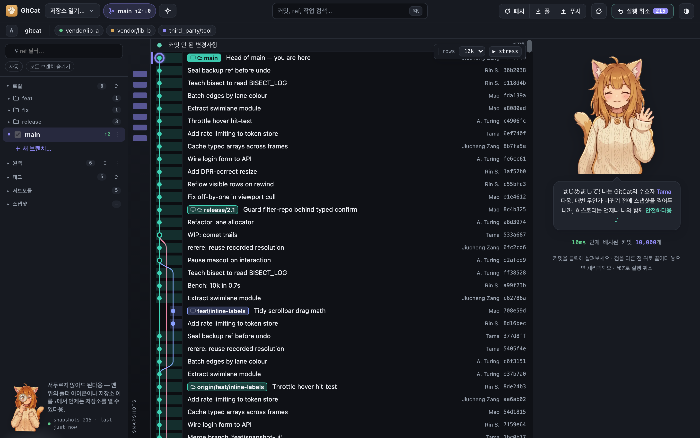

<div align="center">

# 🐱 GitCat

**Git you can take back.**

A cozy, safety-first desktop Git client — Tauri 2 + Rust + Svelte 5. Every mutation snapshots first, so ⌘Z always works.

[](https://github.com/zangjiucheng/GitCat/actions/workflows/ci.yml)
[](https://github.com/zangjiucheng/GitCat/actions/workflows/docs.yml)
[](https://github.com/zangjiucheng/GitCat/actions/workflows/release.yml)
[](LICENSE)

**[Website & docs](https://zangjiucheng.github.io/GitCat/)** · **[Download](https://github.com/zangjiucheng/GitCat/releases)** · **[User guide](https://zangjiucheng.github.io/GitCat/guide/)**


</div>

## Why

Every Git GUI makes it easy to run a dangerous command. GitCat is built so you can take it back: a **Safety Manager** snapshots refs, index, worktree and stash before every mutation, so a global Undo (⌘Z) is always one keystroke away — and Undo is itself undoable.

## Features

- **Fast commit graph** — git2 reads and a Rust swimlane layout on a virtualized canvas, no depth cap. 150k commits scroll smoothly with the text still readable.
- **Everyday git, made safe** — stage by file, hunk or line; commit, stash, branch, tag, checkout; fetch / pull / push; merge, cherry-pick, revert, and rebase (linear plus a drag-to-reorder planner), behind a real 3-way conflict resolver.
- **Diffs that aren't just text** — syntax highlighting, plus side-by-side before/after previews for images and PDFs, rendered natively and zoomable.
- **The deep cuts** — submodules, patch export/apply, `git bisect`, `git blame` with rename-following, per-file history, author and pickaxe search, a `git-filter-repo` wizard, external diff/merge tools, reflog rescue and dangling-object recovery.
- **⌘K everything** — fuzzy search across commits, refs and actions, vim-style keys, and a real native menu.
- **Plugins** *(1.1)* — ⌘K commands, hooks, side panels, named tools, and Tama skins and reactions.
- **English, 中文 & 한국어** — the whole interface, switchable live with no reload.
- **`gitcat .`** — open a repo from your terminal the way `code .` does. WSL-aware.

Full list: **[Features](https://zangjiucheng.github.io/GitCat/features)**.

## Screenshots

| | |
| --- | --- |
| <br>**Commit detail & diff** | <br>**⌘K command palette** |
| <br>**Settings** | <br>**Chinese (中文) interface** |
| <br>**Korean (한국어) interface** | <br>**Light theme** |

## Meet Tama

<p align="center">
  
  
  
  
  
  
  
  
</p>

Tama is the Safety Manager, not a mascot bolted on for cuteness — she's the one pinning the snapshot. Eight expressions wired to real moments: curious while you search, thinking hard mid-rebase, genuinely alarmed right before something irreversible, celebrating once it's safely done.

## Install

Grab an installer from the **[Releases page](https://github.com/zangjiucheng/GitCat/releases)** — macOS (Apple Silicon + Intel), Windows (x86_64 + arm64) and Linux (x86_64 + arm64; `.deb`/`.rpm`/`.AppImage`), all built from the same tag.

> Builds are **unsigned** for now. macOS: right-click → **Open** the first time. Windows: **More info → Run anyway**. Full per-platform steps, including macOS Sequoia, are in the [install guide](https://zangjiucheng.github.io/GitCat/install).

### `gitcat` on your PATH

Run **Install 'gitcat' command** from Settings → Command line (or ⌘K), then open a new terminal:

```bash
gitcat .                 # open the repo in the current directory
gitcat ~/src/my-project  # open a repo by path
```

It writes a launcher to `/usr/local/bin` (macOS), `~/.local/bin` (Linux), or `%LOCALAPPDATA%\Microsoft\WindowsApps` (Windows, plus one inside each WSL distro). The `.deb`/`.rpm` packages already put `gitcat` on `PATH`.

## Development

Needs [Rust](https://www.rust-lang.org/tools/install), [Node](https://nodejs.org) 22+ and [pnpm](https://pnpm.io) 10 (`corepack enable pnpm` if you don't have it — the exact version is pinned in `package.json`'s `packageManager`). On Linux, Tauri also wants WebKitGTK/GTK3 dev headers; on NixOS, `nix develop` has everything.

```bash
pnpm install
pnpm tauri dev      # launch the app
pnpm demo           # build a rich throwaway repo at ~/gitcat-demo to poke at
```

| Command | What it does |
| --- | --- |
| `pnpm check` | svelte-check (type-check the frontend) |
| `pnpm test` | vitest (frontend unit tests) |
| `pnpm test:e2e` | playwright (real browser, mocked IPC) |
| `pnpm screenshots` | regenerate `docs/public/screenshots/` |
| `pnpm docs:dev` | run the docs site locally |
| `cargo test` | the Rust suite (from `src-tauri/`) |

See [CONTRIBUTING.md](CONTRIBUTING.md) before opening a PR.

## Tech stack

- **Rust core** (`src-tauri/`) — [git2](https://github.com/rust-lang/git2-rs) for reads, the `git` CLI for writes (every mutation snapshots first), [tauri-specta](https://github.com/specta-rs/tauri-specta) for a typed IPC boundary generated into `src/ipc/bindings.ts`
- **Frontend** — Svelte 5 islands (one per feature) over a hand-tuned vanilla canvas for the graph itself
- **CI/CD** — `cargo test` + `pnpm test` on every push, a 6-platform release matrix on tags, and a [VitePress](https://vitepress.dev) site auto-deployed to [GitHub Pages](https://zangjiucheng.github.io/GitCat/)

## License

Free software under the [GNU General Public License v3.0 or later](LICENSE). Copyright © 2026 Jiucheng Zang.
