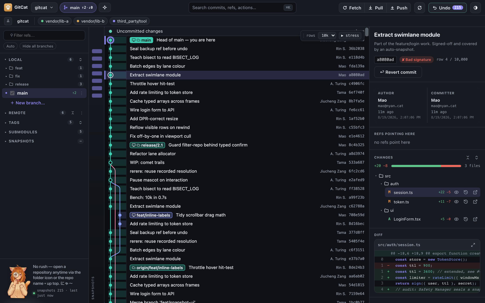
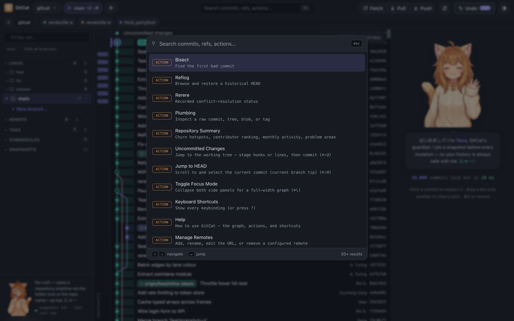
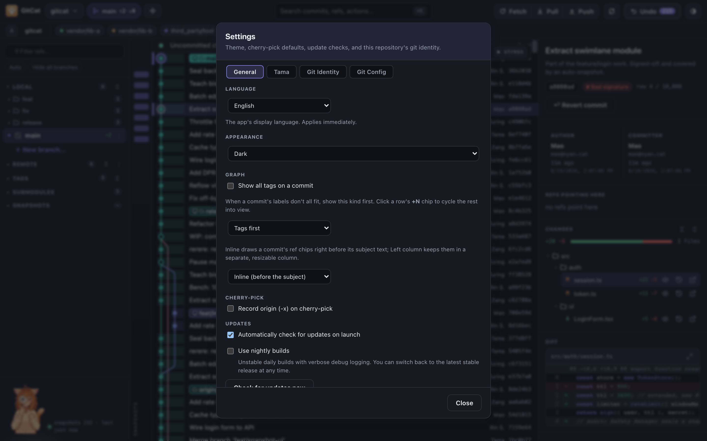
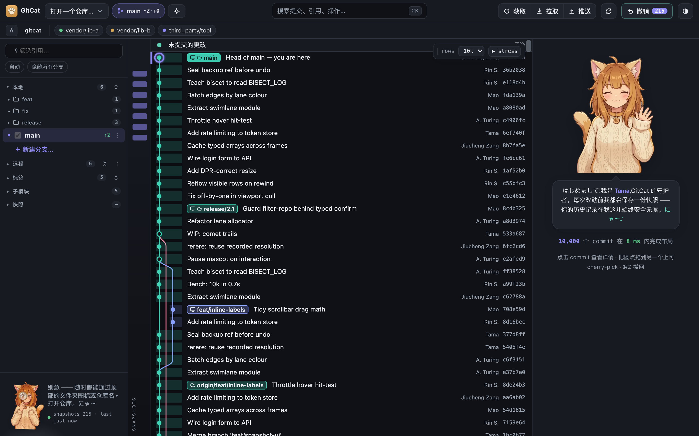
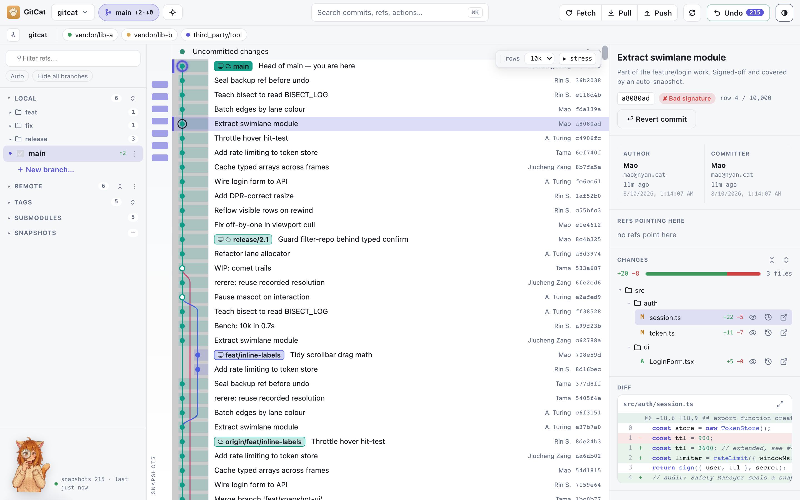

<div align="center">

# 🐱 GitCat

**A cozy, safety-first desktop Git client.**

Tauri 2 + Rust + Svelte 5, with a clean neutral canvas (white / charcoal-dark, color reserved for meaning) — and Tama, a cat mascot who reacts to what's actually happening and keeps a snapshot under you before every mutation.

[](https://github.com/zangjiucheng/GitCat/actions/workflows/ci.yml)
[](https://github.com/zangjiucheng/GitCat/actions/workflows/docs.yml)
[](https://github.com/zangjiucheng/GitCat/actions/workflows/release.yml)
[](LICENSE)

**[Website & docs](https://zangjiucheng.github.io/GitCat/)**


</div>

## What is this?

GitCat is a desktop Git GUI built around one idea: every operation that touches your history should be reversible. A **Safety Manager** snapshots your repo before every mutation, so a global Undo (⌘Z) is always one keystroke away — and Undo is itself undoable.

## Screenshots

<table>
<tr>
<td width="50%"><b>Commit detail &amp; diff</b><br></td>
<td width="50%"><b>⌘K command palette</b><br></td>
</tr>
<tr>
<td><b>Settings</b><br></td>
<td><b>Chinese (中文) interface</b><br></td>
</tr>
<tr>
<td><b>Light theme</b><br></td>
<td></td>
</tr>
</table>

## Meet Tama

<p align="center">
  
  
  
  
  
  
  
  
</p>

Tama is GitCat's Safety Manager, not a mascot bolted on for cuteness — the one pinning a snapshot before every mutation. Eight expressions are wired into real moments across the app: curious while you search, thinking hard mid-rebase, genuinely alarmed right before something irreversible, and celebrating once it's safely done.

## Features

The short version. See the **[full feature guide](https://zangjiucheng.github.io/GitCat/features)** for the exhaustive list.

- **A fast, readable commit graph** — git2 reads plus a hand-tuned swimlane layout, streamed onto a virtualized canvas with no depth cap. Scrolling stays smooth *with readable text* even on a 150k-commit repo. Right-click branches/tags on the graph, snap back to HEAD, and open a full commit detail panel with a syntax-highlighted diff.
- **Everyday git, made safe** — stage by file, hunk, or line; commit, stash, branch, tag, and checkout (with a dirty-tree chooser); fetch / pull / push; merge, cherry-pick, revert, and rebase (linear plus a drag-to-reorder interactive planner) — all backed by a real 3-way conflict resolver.
- **The deep cuts too** — submodules, patch export/apply, `git bisect`, `git blame` with rename-following, per-file history, author and pickaxe search, a `git-filter-repo` wizard, and pluggable external diff/merge tools.
- **A Safety Manager you can trust** — every mutation snapshots first, so global Undo (⌘Z) is always one keystroke away, and itself undoable; plus reflog rescue and dangling-object recovery for when git normally can't help.
- **Plugins** *(new in 1.1)* — extend GitCat with ⌘K commands, hooks, side panels, named tools, and Tama skins and reactions.
- **Speaks your language** *(new in 1.1)* — full English and Simplified Chinese (中文), switchable live with no reload.
- **The bits that make it pleasant** — a multi-repo dashboard (⌘O), a first-run setup wizard, the ⌘K command palette, vim-style keys, a real native menu, WSL-aware remotes, dark/light themes, and opening a repo straight from your terminal (`gitcat .`).

Tama isn't decoration: eight expressions are wired into real moments across the app, from curious-while-searching to genuinely-alarmed right before something irreversible, and celebrating once it's safely done.

## Install

Download the installer for your platform from the [Releases page](https://github.com/zangjiucheng/GitCat/releases) — macOS (Apple Silicon + Intel), Windows (x86_64 + arm64), and Linux (x86_64 + arm64, `.deb`/`.rpm`/`.AppImage`) are all built from the same tag via a 6-platform release matrix.

> Builds are currently **unsigned** (no code-signing certificate configured yet):
>
> - **macOS**: right-click the app → **Open** the first time to get past Gatekeeper.
> - **Windows**: click **More info** → **Run anyway** on the SmartScreen prompt.

## Open from the command line

Point GitCat at a repo straight from a terminal, the way `code .` works in VS Code:

```bash
gitcat .                 # open the repo in the current directory
gitcat ~/src/my-project  # open a repo by path
```

A relative path resolves against your current directory. If the folder isn't a git repository, GitCat still opens and tells you so, rather than loading nothing.

This needs the `gitcat` command on your `PATH`. Open GitCat and run **Install 'gitcat' command** from Settings > Command line (or from ⌘K) on any platform; it writes a small launcher that opens the app without blocking your terminal:

- **macOS** — `/usr/local/bin/gitcat` (you may be asked for your password).
- **Linux** — `~/.local/bin/gitcat` (make sure that folder is on your `PATH`). The `.deb`/`.rpm` packages already put `gitcat` on `PATH` too, so this is mainly for the AppImage.
- **Windows** — `gitcat.cmd` under `%LOCALAPPDATA%\Microsoft\WindowsApps`, which is on `PATH` by default. It also drops a `gitcat` launcher into each installed WSL distro (`~/.local/bin/gitcat`), so `gitcat .` works from a WSL shell too and opens the app on the repo at its `\\wsl.localhost\<distro>\...` path.

Open a new terminal afterwards so it picks up the change.

## Development

Requires [Rust](https://www.rust-lang.org/tools/install), [Node](https://nodejs.org) 22+, and [pnpm](https://pnpm.io) 10. On Linux, Tauri also needs WebKitGTK/GTK3 dev headers at build time — see `.github/workflows/*.yml` for the apt packages, or on NixOS run `nix develop` to drop into a shell with everything (Rust, Node, pnpm, WebKitGTK, and friends) already wired up via `flake.nix`.

The exact pnpm version lives in `package.json`'s `packageManager` field, which is what keeps `pnpm-lock.yaml` from being rewritten by whichever pnpm you happen to have. Any pnpm 10 honours it on its own. Older pnpm does not — it will run as itself and fail here — so if you have pnpm 9 or none at all, let corepack (bundled with Node) handle it:

```bash
corepack enable pnpm
```

Then, from the repo root:

```bash
pnpm install
pnpm tauri dev      # launch the app in dev mode
```

Want a repo to poke at instead of pointing GitCat at something real? `pnpm demo` builds one at `~/gitcat-demo` with branches, tags, a submodule, stashes, a diverged remote, a mix of unmerged branches (some conflicting with `main` on purpose — including one on a large file — some merging cleanly, good for trying the multi-branch merge tool), and a bisectable bug — see `scripts/make-demo-repo.sh` for the full rundown.

Other useful commands:

```bash
pnpm check          # svelte-check (type-check the frontend)
pnpm build          # build the frontend
pnpm test           # vitest (frontend unit tests)
pnpm test:e2e       # playwright (real browser, mocked IPC — see e2e/fixtures/tauriMock.ts)
pnpm docs:dev       # run the docs site (docs/) locally at localhost:5173

cd src-tauri
cargo build         # build the Rust core
cargo test          # run the Rust test suite
```

## Tech stack

- **Rust core** (`src-tauri/`) — [git2](https://github.com/rust-lang/git2-rs) for reads, the `git` CLI for writes (every mutation snapshots first), [tauri-specta](https://github.com/specta-rs/tauri-specta) for a fully typed IPC boundary auto-generated into `src/ipc/bindings.ts`
- **Frontend** — Svelte 5 "islands" (one per feature: resolver, bisect, reflog, rerere, plumbing, filter-repo, setup wizard, repositories dashboard, sidebar, ⌘K, commit detail) layered over a hand-tuned vanilla canvas for the commit graph itself
- **CI/CD** — GitHub Actions: `cargo test` + `pnpm test` on every push/PR, a 6-platform release matrix (macOS/Linux/Windows × arm64/x86_64) on tagged releases, and a [VitePress](https://vitepress.dev) docs site (`docs/`) auto-deployed to [GitHub Pages](https://zangjiucheng.github.io/GitCat/) on every change

## License

GitCat is free software, licensed under the [GNU General Public License v3.0 or later](LICENSE).

Copyright (C) 2026 Jiucheng Zang
